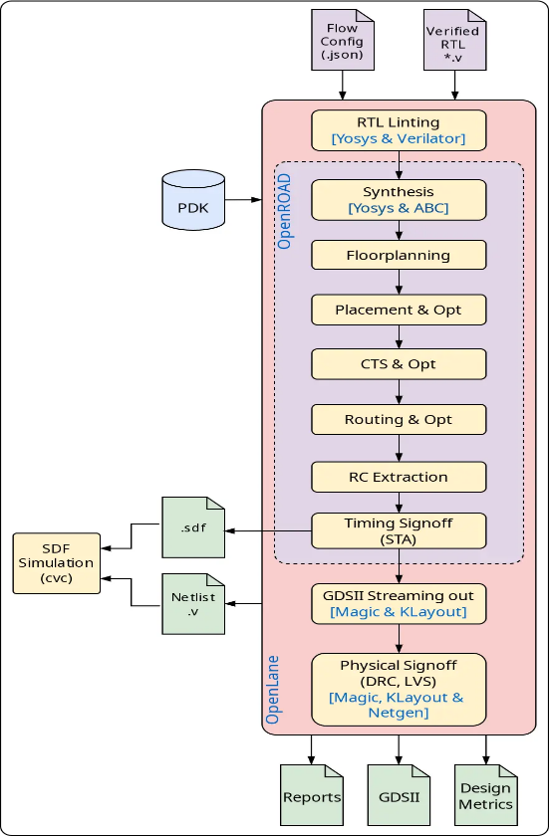
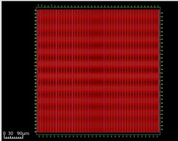
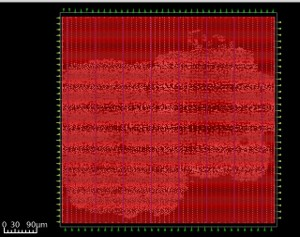
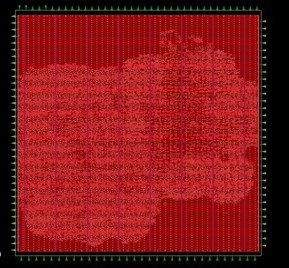
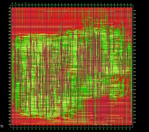
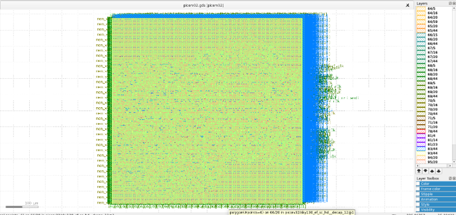

# RISC-V-ASIC-Implementation
This repository presents the ASIC implementation of the open-source PicoRV32 RISC-V processor using the OpenLane RTL-to-GDSII flow on the Sky130 PDK. It documents each physical design stage—from synthesis to GDSII generation—and includes a comparative power, performance, and area (PPA) analysis with a commercial Cadence Genus/Innovus implementation on the GPDK90 technology node.

## Overview

This repository demonstrates the complete ASIC implementation of the open-source **PicoRV32 RISC-V processor** using the **OpenLane RTL-to-GDSII flow** on the **Sky130 PDK**. It documents every major stage of the physical design flow, from synthesis to GDSII generation, and presents a comparative **Power, Performance and Area (PPA)** analysis against a commercial **Cadence Genus/Innovus** implementation using the **GPDK90** technology node.

> **Note:** The PicoRV32 RTL is an open-source processor developed by Clifford Wolf. This repository focuses on the ASIC implementation methodology, physical design flow, and implementation analysis rather than the processor RTL itself.

---

## Objectives

- Demonstrate a complete RTL-to-GDSII implementation using the OpenLane ASIC flow.
- Study the physical implementation of the PicoRV32 RISC-V processor.
- Compare open-source and commercial ASIC implementation flows.
- Analyze Power, Performance and Area (PPA) across different technology nodes.

---

## Technology Stack

| Tool | Purpose |
|------|---------|
| OpenLane | RTL-to-GDSII ASIC Flow |
| OpenROAD | Physical Design |
| Yosys | Logic Synthesis |
| Magic | Layout Generation |
| KLayout | GDSII Visualization |
| Sky130 PDK | Open-source 130nm Technology |
| Cadence Genus | Commercial Logic Synthesis |
| Cadence Innovus | Commercial Physical Design |
| GPDK90 | Commercial 90nm Technology |

---

# OpenLane RTL-to-GDSII Flow

The PicoRV32 processor was implemented using the OpenLane RTL-to-GDSII flow. The resulting design databases from each major implementation stage were visualized using KLayout.

## Flow Diagram

<p align="center">

</p>

---

## Floorplanning

The synthesized design is floorplanned by defining the core area, IO placement, and power distribution network.

<p align="center">

</p>

---

## Placement

Standard cells are placed within the core while minimizing congestion and wirelength.

<p align="center">

</p>

---

## Clock Tree Synthesis (CTS)

Clock buffers are inserted to minimize clock skew and balance clock distribution.

<p align="center">

</p>

---

## Routing

Global and detailed routing establish signal connectivity while satisfying design rule constraints.

<p align="center">

</p>

---

## GDSII Generation

Final physical layout exported in GDSII format.

<p align="center">

</p>

---

# Repository Structure

```
RISC-V-ASIC-Implementation
│
├── README.md
│
├── docs
│   └── images
│       ├── OpenLane_flow.png
│       ├── floorplan.jpg
│       ├── placement.jpg
│       ├── cts.jpg
│       ├── routing.jpg
│       └── gdsii.png
│
└── reports
    ├── openlane
    └── cadence
```

---

# Key Highlights

- Complete OpenLane RTL-to-GDSII implementation
- Sky130 Open-source ASIC Flow
- PicoRV32 RISC-V Core
- Commercial Cadence implementation for comparison
- Power, Performance and Area (PPA) analysis
- GDSII generation and physical layout visualization

---

# References

- Clifford Wolf, **PicoRV32** – https://github.com/YosysHQ/picorv32
- OpenLane Project – https://github.com/The-OpenROAD-Project/OpenLane
- SkyWater SKY130 Open PDK
- OpenROAD Project

---

## Acknowledgements

This repository builds upon the open-source **PicoRV32** processor developed by **Clifford Wolf**. The RTL design remains the work of the original author. This repository focuses exclusively on ASIC implementation, physical design methodology, and comparative implementation analysis.
